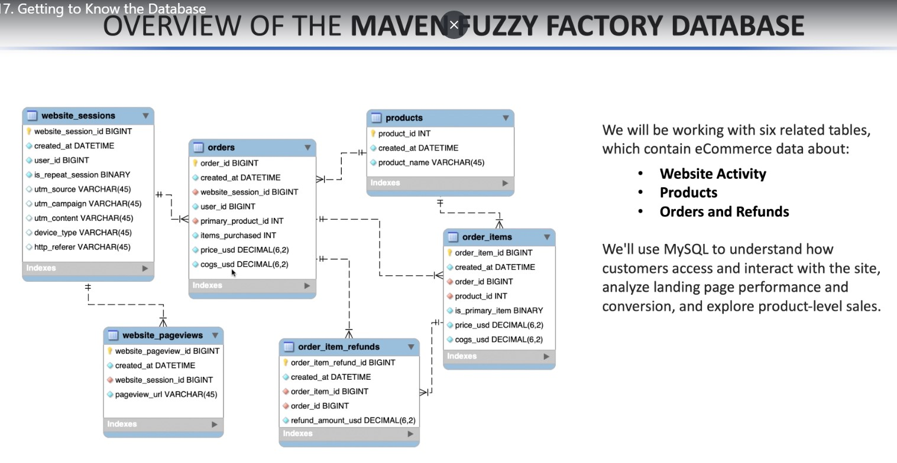

# Database of the project



# Analyzing the Traffic Source


## KEY TABLES


## PAID MARKETING CAMPAIGNS: UTM PARAMETERS


## TRAFFIC SOURCE ANALYSIS PROBLEM


### Solution:

```sql

select
	website_sessions.utm_content,
    count(distinct website_sessions.website_session_id) as sessions,
    count(distinct orders.order_id) as orders,
    sum(orders.price_usd) as revenue,
    count(distinct orders.order_id)/count(distinct website_sessions.website_session_id)
		as conversion_rate
from website_sessions
LEFT JOIN orders
on website_sessions.website_session_id=orders.website_session_id
where website_sessions.website_session_id between 1000 and 2000
group by
	1
order by
	2 desc;

```

## ASSIGNMENT -1 : FINDING TOP TRAFFIC SOURCES


- Show UTM source, campaign, refererring domain
- get data only upto april 12, 2012.

## AADSIGNMENT - 2: FINDING TRAFFIC CONVERSION RATES


- calcularte the conversion rate from session to order

- conditions are created before april 14, 2012,
  utm_source is gsearch and utm_campaign as nonbrand.

### Solution:

```sql
select
	count(distinct website_sessions.website_session_id)
		as sessions,
	count(distinct orders.order_id)
		as orders,
    count(distinct orders.order_id) / count(distinct website_sessions.website_session_id)
		as session_to_order_conv_rates
from
	website_sessions left join orders
	on website_sessions.website_session_id=orders.website_session_id
where
	website_sessions.created_at<'2012-04-14'
    and utm_source='gsearch'
    and utm_campaign='nonbrand';

```
